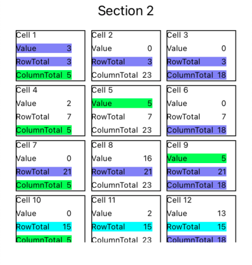

## CollectionViewTest

This project demonstrates creating a `UICollectionView` using a `UICollectionViewDiffableDataSource` instead of an old-school `UICollectionViewDataSource`.

## App behavior

This collection view is very simple. It tracks a value for each cell in a section, and a row total and column total for the rows and columns in each section. As you tap on a cell, it increments the value for that cell, as well as the row total for the row containing that cell, and the column total for the column containing the cell. 

When a cell's value, row total, or column total is a multiple of 3, 5, or 15 it colors the value, row total, or column total line for that cell in blue, green, or cyan, respectively. (using colors to implement FizzBuzz)

An example section of the collection view looks like this:

## Implementation

A diffable data source manages changes to a collection view's model and contents more simply than a `UICollectionViewDataSource`. You create an array of objects, one for each section in your collection view, and then add items to the diffable data source for each entry in a section. 

When you want to update your collection view, you ask the diffable data source for a snapshot of the current values, tell the snapshot to reload items that have changed, and then tell the data source to apply the snapshot. The diffable data source then figures out which cells need to be updated added, removed, or moved, and manages the collection view to affect the changes described in the snapshot.
